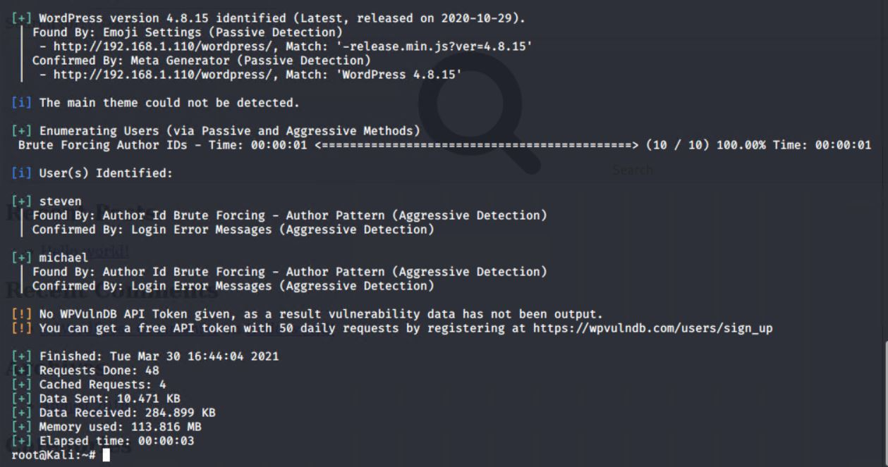

# Red-vs-Blue---Cyber-Security

Azure lab environment  for assessment, analysis, and hardening of a vulnerable system.
This report includes;
   - Red Team (Offensive) Security Assessment
   - Blue Team (Defensive) Log Analysis
   - Network analysis via Wireshark

### Lab Environment 

- **Capstone** (`192.168.1.105`): The VM is in the network solely for the purpose of testing alerts and will forward logs to the ELK machine. 
  
- **ELK** (`192.168.1.100`): The ELK VM that holds the Kibana dashboards.

- **Kali** (`192.168.1.90`): A standard Kali Linux machine for use in the penetration test. 
  
- **Target 1** (`192.168.1.110`): Exposes a vulnerable WordPress server.

- **Target 2** (`192.168.1.115`): Exposes the same WordPress site as above, but with better security hardening. It must be exploited differently than Target 1.

#### Attacking Target 1

Completed the following high-level steps:
1. Scan the network to identify the IP addresses of Target 1.

2. Enumerate the WordPress site.

4. Use SSH to gain a user shell.

   
5. Find the MySQL database password.

     
6. Use the credentials to log into MySQL and dump WordPress user password hashes.

7. Crack password hashes with John.

 
8. Secure a user shell as the user whose password was cracked & escalate to root.

